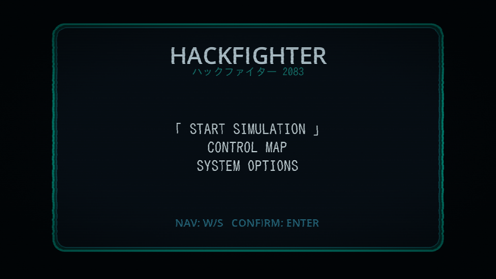

# HACKFIGHTER 2083 / ハックファイター 2083

A two-player browser brawler built in Godot 4. Pick a fighter, pick a stage, throw hands. The skin is cyberpunk-Nous; the engine underneath is real Godot with sprite sheets, audio, CPU AI, and a working Web export pipeline.

Currently shipping with two fighters — **Teknium** and **Lobster** — and one stage, the HACKFIGHTER city. It's a prototype, but it runs in a browser and the punches connect.

▶️ Play in browser: <https://quarker1337.github.io/hackfighter/>

📺 Video: <https://www.youtube.com/watch?v=kSgEnp6wBP8>



> Heads up: the directory is `stoatfighter2-godot` for legacy reasons. The game is HACKFIGHTER 2.

---

## Controls

**Menu**

- Navigate: `W` / `S`
- Confirm: `Enter`
- Back: `U` / `J`
- Switch side on fighter select: `A` / `D`

**Fight**

- Move: `A` / `D`
- Jump: `W`
- Crouch: `S`
- Light / heavy punch: `U`/`J` and `I`/`K`
- Light / heavy kick: `O`/`L` and `P`/`;`

**Debug**

- `F8` — toggle CPU AI
- `F9` — toggle debug overlay

---

## Play it locally

You'll need Godot 4.6.2, the matching Web export templates, and Python 3 to serve. Setup is in [Dev setup](#dev-setup) below.

Once that's in place:

```bash
make export-web
python3 -m http.server 8799 --bind 127.0.0.1 --directory export/web
```

Open <http://127.0.0.1:8799/index.html>, click the HACKFIGHTER audio gate (or press `Enter`), and the menu should come up.

`make export-web` wraps `tools/export_web.sh`, which handles project-specific Web fixes:

- patches `ensureCrossOriginIsolationHeaders` to `false`
- avoids COOP/COEP iframe breakage
- copies real audio into `export/web/audio_bridge/`
- injects the audio unlock bridge

Don't run an ad-hoc `godot --export` — you'll lose those fixes.

---

## Repository layout

```text
.
├── assets/
│   ├── audio/           # announcer, SFX, music, specials
│   ├── real/characters/ # production fighter sprite sheets
│   ├── real/stages/     # production stage art
│   ├── screenshots/     # README screenshots
│   └── ui/              # UI / HUD art
├── scenes/              # Godot scenes (Main.tscn is entry)
├── scripts/             # gameplay, stages, sprite + audio systems
├── tools/
│   ├── export_web.sh    # canonical Web export — use this
│   └── capture_menu_screenshot.js
├── export_presets.cfg   # Godot Web export preset
├── Makefile             # convenience targets
└── project.godot
```

`export/` is build output and is gitignored — rebuild with `make export-web`.

---

## Dev setup

Linux instructions; adjust paths if you're elsewhere.

### 1. Godot 4.6.2

```bash
mkdir -p ~/bin
cd /tmp
curl -L -o godot.zip "https://github.com/godotengine/godot/releases/download/4.6.2-stable/Godot_v4.6.2-stable_linux.x86_64.zip"
unzip -o godot.zip
install -m 700 Godot_v4.6.2-stable_linux.x86_64 ~/bin/godot4-4.6.2
ln -sfn ~/bin/godot4-4.6.2 ~/bin/godot4
~/bin/godot4 --version   # → 4.6.2.stable
```

### 2. Web export templates (matching version)

```bash
mkdir -p ~/.local/share/godot/export_templates/4.6.2.stable
cd /tmp
curl -L -o godot_web_templates.tpz "https://github.com/godotengine/godot/releases/download/4.6.2-stable/Godot_v4.6.2-stable_export_templates.tpz"
python3 - <<'PY'
import zipfile
from pathlib import Path
out = Path.home() / ".local/share/godot/export_templates/4.6.2.stable"
with zipfile.ZipFile("godot_web_templates.tpz", "r") as z:
    z.extractall(out)
PY
mv ~/.local/share/godot/export_templates/4.6.2.stable/templates/* \
   ~/.local/share/godot/export_templates/4.6.2.stable/
rmdir ~/.local/share/godot/export_templates/4.6.2.stable/templates
```

The flatten step matters: the archive nests files under `templates/` but Godot expects them directly under `4.6.2.stable/`.

### 3. Open in editor

```bash
~/bin/godot4 --path .
```

Or open this folder from the Godot project manager.

### 4. (Optional) Screenshot tooling

The README screenshot is generated by Puppeteer. Skip unless you're regenerating it.

```bash
npm install puppeteer
# with the local server running on port 8799:
node tools/capture_menu_screenshot.js \
  assets/screenshots/loading-menu.png \
  http://127.0.0.1:8799/index.html
```

---

## Gotchas

**Binary / template version mismatch.** A 4.6.2 editor with 4.6.1 templates (or vice versa) will produce a Web build that loads the splash and then dies at runtime. Keep them locked together.

**LAN testing over plain HTTP.** Localhost is fine for browser secure-context checks. `http://<lan-ip>` from another machine often isn't — use HTTPS or an SSH tunnel.

**Don't add COOP/COEP headers** if you're embedding the build in an iframe. The project is configured for Web without SharedArrayBuffer / thread isolation, and adding those headers breaks embedding.

**Audio won't play before user interaction.** That's the whole point of the audio gate on the title screen. Browsers require a real click or keypress before any audio context can start.

**Re-export before testing visible changes.** The headless/editor view doesn't always match what the WASM build does. If a change matters, verify it in the browser build.

---

## Project facts

- Engine: Godot 4.6.2
- Native logical resolution: 512×288
- Main scene: `res://scenes/Main.tscn`
- Export target: Web / HTML5
- Audio: Godot-native plus a small browser bridge for Web exports

---

## License

This repository uses split licensing:

- Code, scripts, project config, tooling, and documentation are licensed under the MIT License. See [LICENSE](LICENSE).
- Sprites, music, SFX, stage art, UI art, screenshots, and other non-code creative assets are licensed separately. See [ASSET_LICENSE.md](ASSET_LICENSE.md).

Per-asset notices, if present, override the general asset license.

---

It's the year 2083. You are Teknium. Your opponent is a Lobster. The city is on fire.
